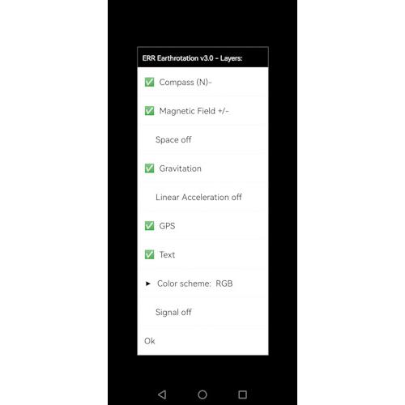
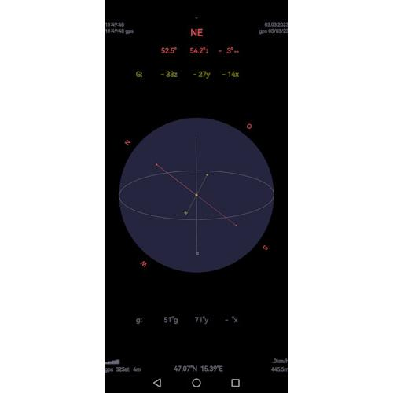

# ERR
Earthrotation `ERR`. Android application for displaying Earth's and local *Magnetic Field* (Assis et al., 2004), *Gravity* (King-Hele et al., 1980), *Acceleration*, *GPS* (Anderle et al., 1980) and more. As an additional tool to the `SSR` Solar System Simulator (Schrausser, 2023) for orientation with a particular focus on position and time determination on Earth.

Figure 1.

SI unit of *magnetic flux* is weber $Wb$ (c.f. Weber, 1867; Vogt, 1949), with

$$Wb = V⋅s,$$

where $V$ is volt and $s$ is second.
The *magnetic flux* of $n⋅Wb$  through a surface of $n$ square meter $m^2$ is $n$ tesla $T$ (see e.g. Swezey, 1958; Šarboh, 2010; Carlson, 2013), or

$$T=\frac{Wb}{m^2}.$$

The *geomagnetic field* or *flux density* $B_E$ is calculated in microteslas $μT$ or gauss $G$, respectively (c.f. Gauss et al., 1840; Dunnington, 1934), where 

$$G= μT⋅100.$$

$B_E$ normaly ranges from about $B_E\ge0.25G$ to $B_E\le0.65G$.  

Figure 2.

The *orientation* to the *geomagnetic field* is given in angular degrees $\alpha°$ on the $x$, $y$ and $z$ axes; it is defined as a *dipole* inclined at approximately $\alpha=9.6°$ relative to the axis of rotation.

The Earth's *gravity* $g$ is a combined *acceleration* effect of gravitation from mass and centrifugal force from rotation (see e.g. Caputo, 1967; Officer, 1974; King-Hele et al., 1980). SI unit is meters per second squared $\frac{m}{s^2}$, newtons per kilogram $\frac{N}{kg}$, respectively. Near the surface, the acceleration of *one* $g_n$ is approximately
$$g_n=9.8 \frac{m}{s^2}.$$ 

Given Earth's rotation and spherical asymmetry, but also tidal forces, variations in local topography, density distributions within the Earth, etc., there are deviations or *gravity anomalies* as the difference between the observed acceleration and the predicted model value $g_n$ of the *International Reference Ellipsoid*, c.f. Lambert (1926), Kaula (1970), Bowin (1991), Hinze et al. (2013), Götze (2020) or Hu et al. (2023).

The *orientation* to the *gravitational field* $g$, as well as fluctuations $z$ and deviations from local accelerations $d$, are also specified in angular degrees $\alpha°$.

Figure 3.

The current *global position* $P_x$ is displayed using the *geographic coordinate system* GCS, a spherical coordinate system for measuring positions on Earth in terms of *latitude* $\phi$ and *longitude* $\lambda$, where $\phi$ is the angle between the *equatorial plane* and $P_x$ and $\lambda$ is the angle between a *reference meridian* and $P_x$, given in angular degrees *°N-°S* or *°W-°E*, respectively. See e.g. Anderle et al. (1980), Daniel & Daniel (2012), Acharya (2014) or Chang (2016).

### References

Acharya, R. (2014). *Understanding Satellite Navigation*. 1st ed. Cambridge, Massachusetts: Academic Press. https://doi.org/10.1016/C2013-0-06964-2.

Anderle, R. J., Allan, A. L., Leppard, N. A. G., Krakiwsky, E. J., & Merson, R. H. (1980). The Global Positioning System and Discussion. *Philosophical Transactions of the Royal Society of London. Series A, Mathematical and Physical Sciences 294* (1410): 395–406. http://www.jstor.org/stable/36536.

Assis, A. K. T., Reich, K., & Wiederkehr, K. (2004). On the Electromagnetic and Electrostatic Units of Current and the Meaning of the Absolute System of Units — for the 200th Anniversary of Wilhelm Weber’s Birth. *Sudhoffs Archiv 88* (1): 10–31. http://www.jstor.org/stable/20777923.

Bowin, C. (1991). The Earth’s Gravity Field and Plate Tectonics. *Tectonophysics 187* (1): 69–89. https://doi.org/10.1016/0040-1951(91)90414-N.

Caputo, M. (1967). *The Gravity Field of the Earth from Classical and Modern Methods. Edited by van Mieghem, J*. 1st ed. Cambridge, Massachusetts: Academic Press. https://shop.elsevier.com/books/the-gravity-field-of-the-earth/van-mieghem/978-1-4831-9735-7#full-description.

Carlson, W. B. (2013). *Tesla: Inventor of the Electrical Age*. Princeton, New Jersey: Princeton University Press. http://www.jstor.org/stable/j.ctt24hpng.

Chang, K. T. (2016). *Introduction to Geographic Information Systems*. New York: McGraw-Hill Education. https://books.google.com/books?id=DokZogEACAAJ.

Daniel, L. E., and Daniel, L. E. (2012). Chapter 42 - Global Positioning Systems. In *Digital Forensics for Legal Professionals*, 309–19. Boston: Syngress. https://doi.org/10.1016/B978-1-59749-643-8.00042-0.

Dunnington, G. W. (1934). The Historical Significance of Carl Friedrich Gauss in Mathematics and Some Aspects of His Work. *Mathematics News Letter 8* (8): 175–79. http://www.jstor.org/stable/3027789.

Gauss, C. F., Weber, W. E., & Goldschmidt, C. W. B. (1840). *Atlas Des Erdmagnetismus Nach Den Elementen Der Theorie Entworfen.* Leipzig: Weidmann’sche Buchhandlung. https://archive.org/details/bub_gb_uTkAAAAAQAAJ/.

Götze, H.-J. (2020). International Gravity Formula. In *Encyclopedia of Solid Earth Geophysics*, edited by Gupta, H. K., 1–2. Cham: Springer International Publishing. https://doi.org/10.1007/978-3-030-10475-7_102-1.

Hinze, W. J., von Frese, R. R. B., & Saad, A. H. (2013). Gravity Anomaly Interpretation. In *Gravity and Magnetic Exploration: Principles, Practices, and Applications*, 175–212. Cambridge: University Press. https://doi.org/10.1017/CBO9780511843129.008.

Hu, X., Shum, C. K., & Bevis, M. (2023). A Triaxial Reference Ellipsoid for the Earth. *Journal of Geodesy 97* (4): 29. https://doi.org/10.1007/s00190-023-01717-1.

Kaula, W. M. (1970). Earth’s Gravity Field: Relation to Global Tectonics. *Science 169* (3949): 982–85. http://www.jstor.org/stable/1729492.

King-Hele, D. G., & Leppard, N. A. G. (1980). The Gravity Field of the Earth [and Discussion]. *Philosophical Transactions of the Royal Society of London. Series A, Mathematical and Physical Sciences 294* (1410): 317–28. http://www.jstor.org/stable/36527.

Lambert, W. D. (1926). The Figure of the Earth and the New International Ellipsoid of Reference. *Science 63* (1627): 242–48. http://www.jstor.org/stable/1650705.

Officer, C. B. (1974). Gravity. In *Introduction to Theoretical Geophysics*, 260–302. Berlin, Heidelberg: Springer Berlin Heidelberg. https://doi.org/10.1007/978-3-642-65731-3_8.

Šarboh, S. (2010). The Patents of Nikola Tesla. *World Patent Information 32* (4): 335–39. https://doi.org/10.1016/j.wpi.2009.11.001.

Schrausser, D. G. (2023). SSR: Solar System Simulator. *Zenodo Publications 2023* (12/10). https://doi.org/10.5281/zenodo.10338851.

Swezey, K. M. (1958). Nikola Tesla. *Science 127* (3307): 1147–59. http://www.jstor.org/stable/1756073.

Vogt, J. (1949). Wilhelm Weber. *Gnomon 21* (3/4): 176–79. http://www.jstor.org/stable/27677119.

Weber, W. (1867). *Elektrodynamische Massbestimmungen Insbesondere über Diamagnetismus*. Abhandl. D. Math.-Phys. Kl. D. Kgl. Sächs. Gesellsch. D. Wiss. 1, [8]. 1867. Leipzig: Hirzel. https://books.google.com/books?id=Om__vgEACAAJ.
